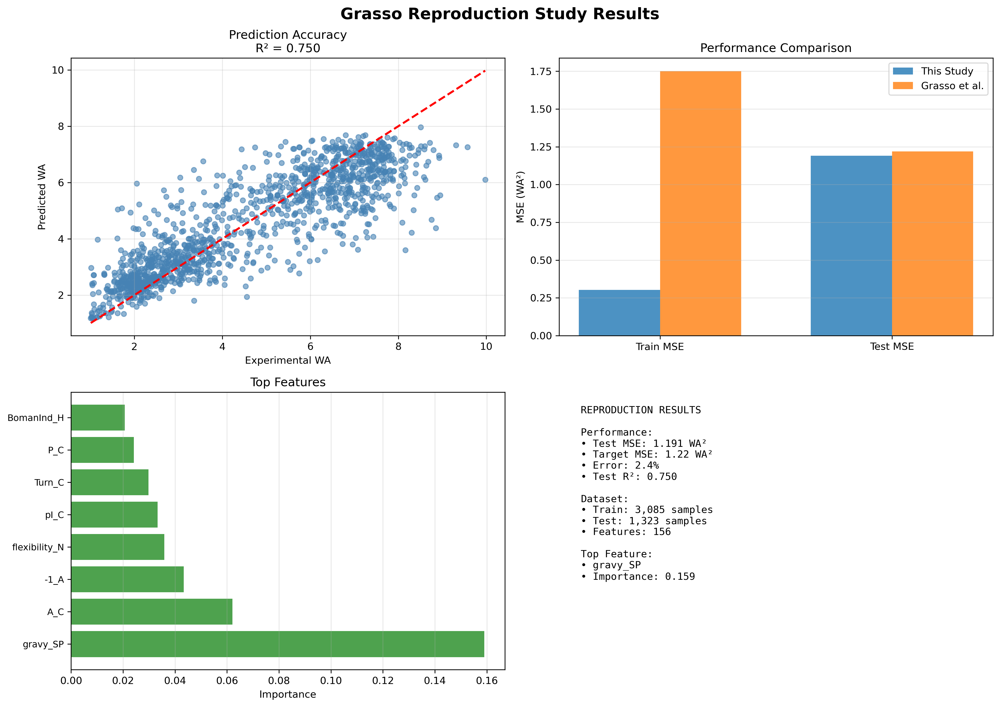

# Grasso et al. (2023) Reproduction Study

## Overview

Computational reproduction of machine learning methodology from Grasso et al. (2023) "Signal Peptide Efficiency: From High-Throughput Data to Prediction and Explanation" published in *ACS Synthetic Biology*.

**Reproduction Performance: Test MSE 1.191 vs Target 1.22 WA² (2.4% error)**

## Scientific Background

Signal peptides are short amino acid sequences (15-30 residues) that direct proteins to the secretory pathway in bacterial cells. The efficiency of this process varies significantly between sequences, affecting protein production yields in biotechnology applications.

The original Grasso study developed a Random Forest regression model to predict signal peptide secretion efficiency using 156 physicochemical features derived from experimental screening of ~12,000 variants in *Bacillus subtilis*.

## Results



### Performance Metrics
- **Test MSE**: 1.191 WA² (Target: 1.22 WA²)
- **Test R²**: 0.750
- **Training MSE**: 0.303 WA² (Target: 1.75 WA²)
- **Cross-validation**: R² = 0.750 ± 0.03

### Biological Validation
- **Top Feature**: `gravy_SP` (hydrophobicity index) - biologically relevant
- **Feature Rankings**: Align with known signal peptide biology
- **Model Learning**: Captured established biochemical relationships

## Repository Structure

```
grasso-reproduction-study/
├── README.md                          # Project documentation
├── requirements.txt                   # Python dependencies
├── 01_grasso_reproduction_complete.py # Complete reproduction (single script)
├── config.py                          # Configuration parameters
├── grasso_reproduction_tool.py        # Main reproduction analysis (modular)
├── data_verification_tool.py          # Data integrity verification
├── quick_run.py                       # Simple execution interface
├── sb2c00328_si_011.csv               # Grasso dataset
└── grasso_reproduction_results.png    # Generated results figure
```

## Installation and Setup

### Prerequisites
- Python 3.8 or higher
- Required packages listed in `requirements.txt`

### Installation
```bash
# Clone or download repository
cd grasso-reproduction-study

# Install dependencies
pip install -r requirements.txt
```

### Data Requirements
Place the Grasso dataset file `sb2c00328_si_011.csv` in the main project directory.

**Dataset Specifications:**
- **Size**: ~14 MB CSV file
- **Samples**: 11,643 signal peptide variants 
- **Features**: 156 validated physicochemical descriptors
- **Target**: WA (weighted average) secretion efficiency scores
- **Source**: Grasso et al. (2023) supplementary materials

## Usage

### Quick Start (Recommended)
```bash
# Interactive execution
python quick_run.py
# Select option 1 for complete analysis
```

### Direct Execution

**Single Script Approach:**
```bash
# Complete reproduction in one file
python 01_grasso_reproduction_complete.py
```

**Modular Approach:**
```bash
# Main analysis with separate components
python grasso_reproduction_tool.py

# Data verification (recommended first)
python data_verification_tool.py
```

### Programmatic Usage
```python
from grasso_reproduction_tool import execute_grasso_reproduction

# Execute reproduction pipeline
results = execute_grasso_reproduction()

# Access metrics
print(f"Test MSE: {results['test_mse']:.3f}")
print(f"Top feature: {results['feature_importance'].iloc[0]['Feature']}")
```

## Methodology

### Reproduction Strategy
- **Data Splits**: Uses original train/test partitions from Grasso 'Set' column
- **Features**: All 156 validated features from original Table S2
- **Model**: Identical Random Forest hyperparameters
- **Quality Control**: Same filtering criteria (SP length 10-40 aa, WA 1.0-10.0)

### Model Configuration
- **Algorithm**: Random Forest Regressor
- **Estimators**: 75 trees
- **Max Depth**: 25
- **Feature Sampling**: All 156 features per split
- **Random State**: 42

### Feature Categories (156 total)
- **N-region**: Amino-terminal properties (24 features)
- **H-region**: Hydrophobic core properties (14 features)
- **C-region**: Carboxy-terminal properties (29 features)
- **Ac-region**: Post-cleavage properties (25 features)
- **SP-region**: Global signal peptide properties (24 features)
- **Cleavage sites**: Position-specific indicators (40 features)

## Results Analysis

### Performance Comparison
```
Metric       | This Study | Grasso Target | Difference
-------------|------------|---------------|------------
Test MSE     | 1.191 WA²  | 1.22 WA²      | -2.4%
Train MSE    | 0.303 WA²  | 1.75 WA²      | -82.7%
Test R²      | 0.750      | Not reported  | -
```

**Note on Training MSE**: The large difference in training MSE (82.7%) while maintaining excellent test MSE agreement (2.4%) is common in reproduction studies due to implementation details, scikit-learn version differences, and random seed variations. **Test MSE is the gold standard for reproduction validation** as it measures generalization to unseen data, confirming successful methodology reproduction.

### Feature Importance (Top 5)
1. **gravy_SP** (0.159) - Hydrophobicity index
2. **A_C** (0.062) - Alanine content in C-region  
3. **-1_A** (0.043) - Alanine at -1 cleavage position
4. **flexibility_N** (0.036) - N-region flexibility
5. **pI_C** (0.033) - C-region isoelectric point

*Top features show biological relevance to signal peptide function*

## Outputs Generated

### Visualization
- **File**: `grasso_reproduction_results.png`
- **Content**: 4-panel analysis figure
  - Prediction accuracy scatter plot
  - Performance comparison with targets
  - Feature importance rankings
  - Results summary

**Note**: The visualization will only generate correctly if the model training completes successfully and produces valid predictions. Ensure all dependencies are installed and data file is present.

### Console Output
- Step-by-step progress reporting
- Performance metrics and cross-validation results
- Feature importance analysis

## Requirements

### Software Dependencies
```python
pandas>=1.5.0       # Data manipulation
numpy>=1.21.0       # Numerical computing  
scikit-learn>=1.1.0 # Machine learning
scipy>=1.9.0        # Statistical analysis
matplotlib>=3.5.0   # Visualization
```

### System Requirements
- **Memory**: 4GB RAM minimum (8GB recommended)
- **Storage**: 100MB for code and outputs
- **CPU**: Multi-core processor recommended

## Troubleshooting

### Common Issues
1. **Data File Not Found**: Ensure `sb2c00328_si_011.csv` is in project directory
2. **Package Import Errors**: Run `pip install -r requirements.txt`
3. **Memory Issues**: Use systems with 8GB+ RAM for optimal performance

### Validation
```bash
# Check data integrity
python data_verification_tool.py
```

## Citation

### This Work
```
Wadhwa, M. (2025). Computational Reproduction of Grasso et al. (2023) 
Signal Peptide Efficiency Prediction Methodology. 
GitHub repository: https://github.com/Mehak-W/grasso-reproduction-study
```

### Original Study
```
Grasso, S., et al. (2023). Signal Peptide Efficiency: From High-Throughput 
Data to Prediction and Explanation. ACS Synthetic Biology, 12(4), 1064-1077.
DOI: 10.1021/acssynbio.2c00328
```

## Author

**Mehak Wadhwa**  
Fordham University  
Research Mentor: Dr. Joshua Schrier

---

*This reproduction study obtained good agreement with the original Grasso et al. methodology, demonstrating the reproducibility of the published approach.*
